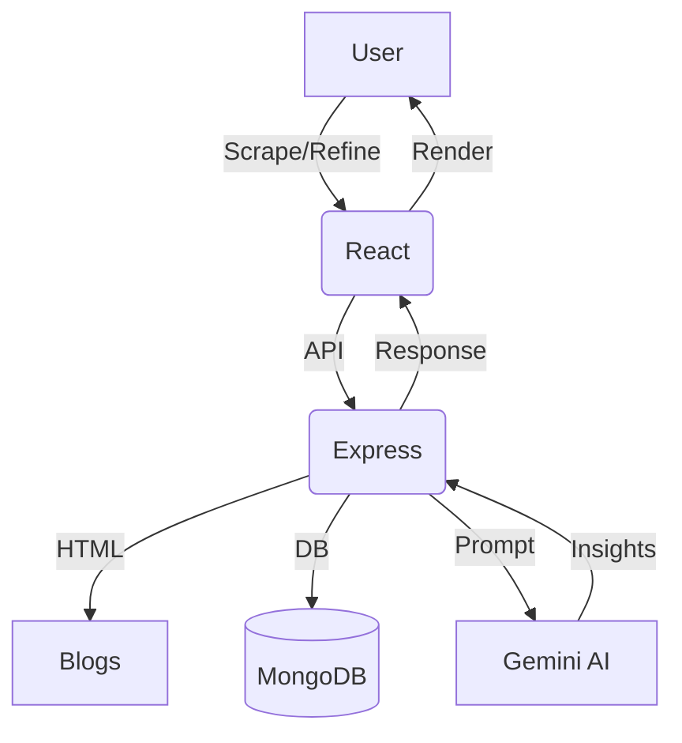

# BeyondChats | Knowledge Evolution 🚀

**BeyondChats** converts dense technical blogs into structured insights using **Gemini 2.0 Flash**. Users compare original vs AI-enhanced output.

---

## Live Demo
- Frontend: https://beyondchats-frontend-sepia.vercel.app  
- Backend: https://beyondchats-backend-lrwz.onrender.com

---

## Setup

### Backend
```bash
cd beyondchats-backend
npm install
```
`.env`
```env
PORT=5001
MONGO_URI=<uri>
GEMINI_API_KEY=<key>
```
```bash
npm start
npm run dev # dev mode
```

### Frontend
```bash
cd ../beyondchats-frontend
npm install
```
`.env`
```env
VITE_API_URL=your backend url or localhost url
```
```bash
npm run dev
```

---

## Architecture


---

## Features
AI insights • Blog scraping • Original vs Enhanced view

---

## Tech
MERN • Cheerio • Gemini AI • Tailwind • Axios • Lucide Icons

---

## Author
**Shivansh Tyagi** — SVNIT ’26
